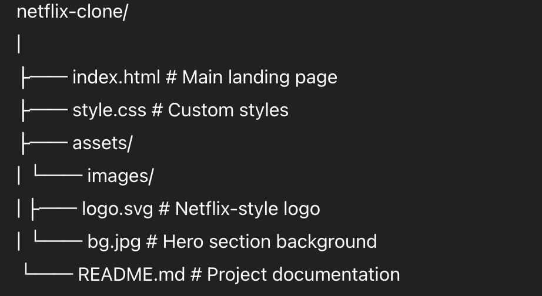
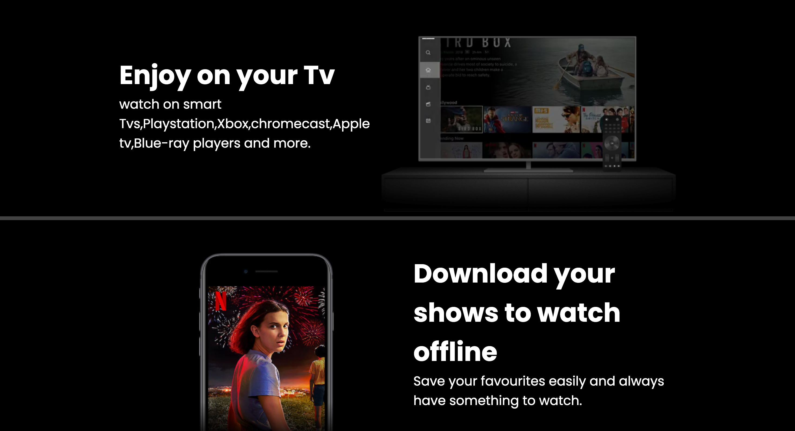
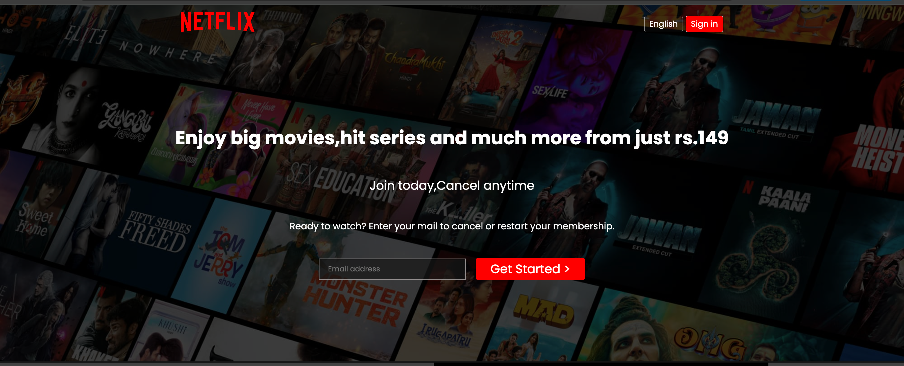
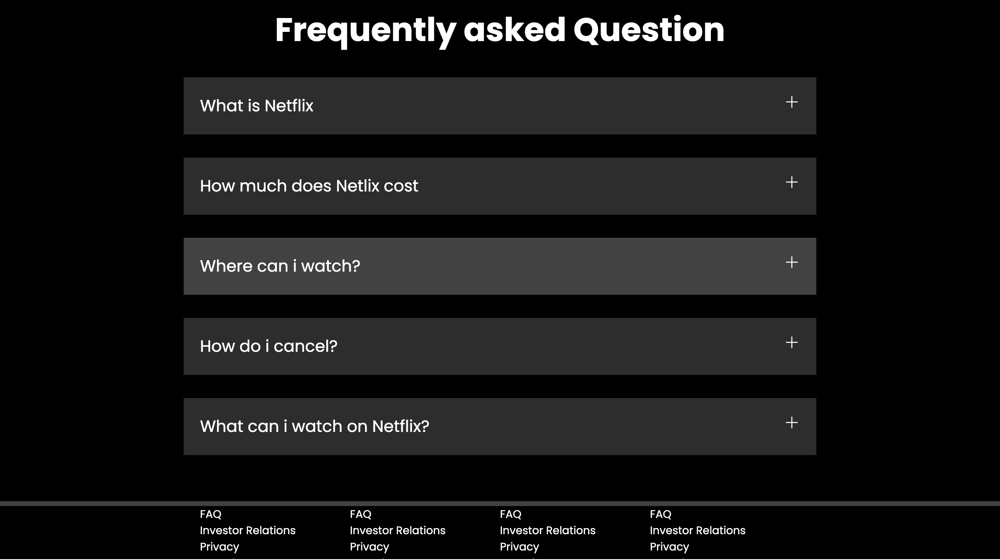

# 🎬 Netflix-Inspired Landing Page Clone

A sleek and responsive clone of the Netflix landing page built using **HTML5** and **CSS3**. This project is designed to mimic the modern aesthetics and structure of Netflix’s homepage, featuring a clean UI, responsive layout, and interactive FAQ section — all without a single line of JavaScript.

---

## 📸 Live Demo

> 👉 [sagarnetfix.netlify.app]  


---

## 🚀 Features

- ✅ Fully responsive and mobile-friendly design
- ✅ Background image with dark overlay
- ✅ Video overlays embedded within device frames
- ✅ Hero section with email input and CTA button
- ✅ Interactive FAQ section using hover effects
- ✅ Footer with grid-based link structure
- ✅ Clean, scalable, and well-commented CSS

---

## 📁 Folder Structure



---

## 🛠️ Technologies Used

- **HTML5** – Markup structure
- **CSS3** – Styling, Flexbox, Grid, media queries
- **Google Fonts** – "Poppins" and "Martel Sans"
- **SVG Icons** – For plus symbols in FAQ

---

## 📱 Responsive Design

The layout adjusts gracefully across all devices:

- 💻 Desktop
- 📱 Mobile
- 📟 Tablets

Media queries and flexible widths make sure the experience stays consistent and user-friendly.

---

## 📌 Key Sections

- **Navigation Bar**
  - Includes logo and buttons for language and sign-in
- **Hero Section**
  - Contains bold headings, subtext, input field, and CTA
- **Feature Sections**
  - Watch on TV, download shows, stream everywhere, create profiles for kids
- **Interactive FAQ**
  - Accordion-style layout with SVG toggles
- **Footer**
  - Clean grid with multiple repeated columns of links

---




> You can insert screenshots here once your project is live.

---

## 🧪 How to Run Locally

1. Clone this repository:
   ```bash
   git clone https://github.com/your-username/netflix-landing-page.git
2. Navigate to the project directory:
cd netflix-landing-page
3. Open index.html in your browser.

No build tools, dependencies, or installations required.


✍️ Author
Sagar Katoch
🎓 Student at Jaypee University, Solan (Waknaghat), Himachal Pradesh
🧑‍💻 Passionate about front-end web development and UI design

LinkedIn

Instagram

📃 License
This project is created solely for educational and personal portfolio purposes.
Netflix® is a registered trademark of Netflix, Inc. This project is not affiliated with Netflix in any way.




Let me know if you'd like to add deployment instructions (e.g. GitHub Pages setup) or badges like "Built with ❤️" etc.
