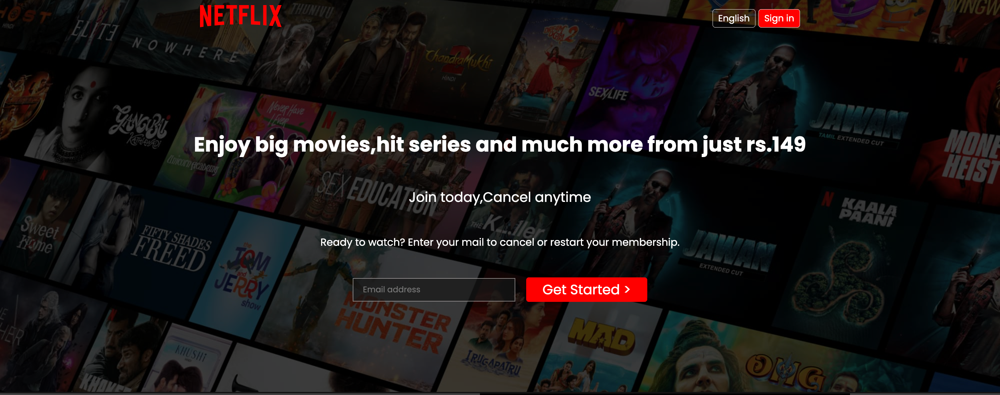
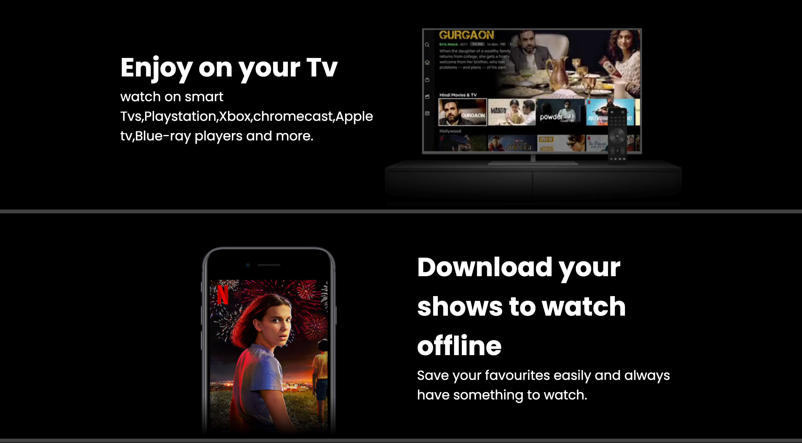

🎬 Netflix Clone - Frontend UI
A responsive front-end clone of Netflix’s landing page built using HTML5 and CSS3. This project replicates the visual style and layout of Netflix to practice UI/UX design, responsive layout techniques, and clean semantic code structure.

🚀 Features
Responsive hero section with call-to-action

Navigation bar with logo and buttons

Background overlay effect

Multiple content sections with text, images, and videos

Download and Kids profiles sections

Styled FAQ section with interactive layout

Reusable buttons and layout utilities

Flexbox and Grid-based layout

🛠️ Tech Stack
HTML5

CSS3 (Flexbox & Grid)

Fonts from Google Fonts

🎯 Purpose
This project was developed for practicing modern front-end design, layout structuring, and component-based styling using pure HTML and CSS without any frameworks or libraries.

📸 Screenshots
Add screenshots here if needed using:

markdown
Copy
Edit

📂 Folder Structure
markdown
Copy
Edit
├── index.html
├── style.css
└── assets/
    └── images/
